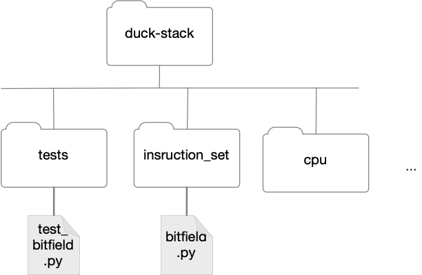

# Bit Fields HOWTO

The binary machine code of the Duck Machine packs several fields into
each instruction word, as does any modern processor architecture.  One
part of the processor, therefore, must *decode* instructions by
unpacking those fields into separate objects.

DM2022 is a 32-bit computer architecture.  Each instruction word is a
32-bit integer, the registers are 32 bits wide, and memory is
addressed as a sequence of 32-bit words.  (All but the last of these
is common; most modern computers address memory as 8-bit bytes.)

## Parts

As with any modern processor, the DM2022 CPU includes a component for
decoding instructions. This component makes use of some circuitry for
extracting each of the bit fields that make up the internal
representation of an instruction.  Our simulation will closely follow
that hardware organization: We will build a module that extracts bit
fields, and then an instruction decoder that uses the bit field
manipulator.  Then we will build an arithmetic logic unit (ALU) that
is controlled by the operation code portion of an instruction.  The
ALU will be incorporated into a central processing unit (CPU) in the
next part of this project.

## BitField objects

Since we will be extracting the same bitfields over and over, we will
build one object for extracting each of the fields we will want.  For
example, suppose bits 5..7 represented some field *spoons*.  (It
doesn't, but pretend.)  Then we would like to create an object that
can extract just that field:

```python
spoon_extractor = BitField(5,7)
```

Thereafter we would use the same object to extract the 
*spoon* field from each instruction word: 

```python
spoon = spoon_extractor.extract(word)
```

## Preliminaries: bitfield.py

We'll create a module ```bitfield.py```  (and we might as well 
create ```test_bitfield.py``` as well.)  After the header
docstring for ```bitfield.py```, we'll insert some standard 
code for making it easy to turn some special logging 
messages on and off.  These could be useful for debugging.
`bitfield.py` should be created in subfolder `instruction_set`.

```python
"""A bit field is a range of binary digits within an
unsigned integer.   Bit 0 is the low-order bit,
with value 1 = 2^0.  Bit 31 is the high-order bit, 
with value 2^31. 

A bitfield object is an aid to encoding and decoding 
instructions by packing and unpacking parts of the 
instruction in different fields within individual 
instruction words. 
"""

import logging
logging.basicConfig()
log = logging.getLogger(__name__)
log.setLevel(logging.DEBUG)
```

Later, when we want to print a message for debugging, 
we will write 
```python
log.debug("some useful log message")
````

If we have the level at ```logging.DEBUG```, the message 
will be printed.  If we change it to 
```python
log.setLevel(logging.INFO)
```
the message will not be printed.  This can be much nicer
than erasing or commenting out debug messages that 
might come in handy again later. 

Some of the things we will do depend on the word size 
of the DM2022, which is 32 bits.  We'll make a symbolic 
constant for this so that it will be easier to adapt later 
if Duck Machines Inc produces a 64-bit CPU model. 

```python
WORD_SIZE = 32 
```

## Shift and mask 

Suppose we want to extract bits m..n and ignore all 
other bits of a word.  We can do it in two steps: 
first we *shift* the bits to the rightmost portion 
of an integer, and then we *mask* the bits we want. 

We'll work a small example with an 8-bit word to get
the idea.  Suppose we want bits 3..5 (with the 
usual convention that lowest order bit is bit 0, 
the next bit is bit 1, etc; the highest bit is 7 
and represents 2^7.  

Suppose the input number is ```0b11110111``` (decimal 247).
```python
x = 0b11110111
``` 
We imagine this as (11)(110)(111); we want the 110 in the 
middle.  We start by shifting the whole number right 
three bits, shoving the low-order 111 off the end. 
```python
x = x >> 3
```
This gives us 0b11110, which we can imagine as 
(11)(110), i.e., the part we want is now in the low-order bits. 
We just need to get rid of the rest.  We can do this 
with the binary *and* operation, which in python is written 
```&```. 
```python
x = x & 0b111
```
This extracts the desired result of 0b110, or decimal 8. 

We just need to make objects that can peform the right shifting and 
masking for a specified bit field.  

```python
class BitField(object):
    """A BitField object extracts specified 
    bitfields from an integer. 
    """
    def __init__(self, from_bit: int, to_bit: int) -> None: 
        """Tool for  extracting bits 
        from_bit ... to_bit, where 0 is the low-order
        bit and 31 is the high-order bit of an unsigned
        32-bit integer. For example, the low-order 4 bits 
        could be represented by from_bit=0, to_bit=3. 
        """ 
```
Just to be on the safe side, let's make sure the 
field fits in the word size: 

```python
        assert 0 <= from_bit < WORD_SIZE
        assert from_bit <= to_bit <= WORD_SIZE
```

Then the first part of the initialization is obvious: 

```python
        self.from_bit = from_bit
        self.to_bit = to_bit
```

Rather than create the mask value every time we extract a value, we
want to compute it once in the constructor and use it over and over.
We can create a mask of *n* bits by repeatedly shifting it left 1 bit
and then filling the low-order bit with a 1.  The bitwise *or*
operation is represented by ```|``` in Python.  For example, if we
wanted to create a 5-bit mask, we could do it this way:

```python
mask = 0
for i in range(5):
   mask = (mask << 1) | 1
```

The mask we need for a BitField object depends on the 
width of the field.  For example, if the field is bits 3 through 5, 
then field is 3 bits wide and would need a mask 
  of 0b111. A field from bit 5 to bit 5 would be
one bit wide, and would need a mask of 0b1. Add code 
to the BitField constructor to create a mask of the 
right width depending on ```from_bit``` and ```to_bit```. 
Save it as `self.mask`. 

Note that even if we defined a three bit field in bit positions
3..5, we would create a mask in bit positions 0..2 . 

With the mask, we have enough to create the ```extract```
method.

```python
    def extract(self, word: int) -> int:
        """Extract the bitfield and return it in the 
        low-order bits.  For example, if we are extracting
        bits 3..5, the result will be an 
        integer between 0 and 7 (0b000 to 0b111). 
        """
```

You will need shift the word right with the ```>>``` operation, mask
it, and return the result.  It could be from one line to three lines
of code, depending on how you organize it.

## Creating `test_bitfields`

With the constructor and extract method, we are ready to write some
simple test cases in ```test_bitfields.py```.  But we will approach
this a little differently than we have in prior projects.  This time
we are going to keep the test suites for each part of the multi-part
project together in a `tests` directory, as recommended in [The
Hitchikers Guide to
Python](https://docs.python-guide.org/writing/structure/)



How will we import `bitfields.py` when it is in a different
folder?   We'll tell Python explicitly where to look for it, 
by starting the search in the top-level project directory
and giving an explicit path to the folder we want.

In Python file paths, as well as in Unix-derived operating
systems including Linux and MacOS, ".." means "the directory 
that encloses this directory", which we can think of as
"one directory up".  We'll instruct Python to start its searches
one directory "up" from the current file: 

```python
# Help Python find the module(s) we want to test,
# telling it that search paths start one folder "up" in the hierarchy
import sys, os
this_folder = os.path.abspath(os.path.join(os.path.dirname(__file__)))
sys.path.insert(0, os.path.abspath(os.path.join(this_folder, "..")))
```

We could put this directly in the `test_bitfields` module, but
instead I will put it in a separate `context.py` module, and import
that into `test_bitfields` to trigger the modification of the 
search path.  Because Python will load the context module just once
no matter how many times it is references, putting a `context.py`
module in each directory is a tricky workaround to allow us to set 
the search path correctly regardless of where we start execution. 

_Aside:_  I do not like manipulating the Python search
path like this.  I think it's a smelly hack.  It
appears to be a standard Python idiom, so we will live with it.
I hope  some future version of Python provides a cleaner approach. 

Now that we have told Python how to search from the top-level
project directory, we can make an `import` command that
starts there and finds the `instruction_set` directory. 

```python
"""Unit tests for bitfield.py"""
import unittest
from instruction_set.bitfield import BitField

class Test_Extract(unittest.TestCase):

    def test_extract_low(self):
        """Extract low 3 bits"""
        low_bits = BitField(0,3)
        self.assertEqual(low_bits.extract(0b10101010101), 0b101)

    def test_middle_bits(self):
        """Extract 5 bits from the middle of a word"""
        middle_bits = BitField(5,9)
        self.assertEqual(middle_bits.extract(0b1010101101101011), 0b11011)
```


If everything is working, we should now be able to
execute the 

## Packing fields into words

Well, that was easy!  (Unless it didn't work.)  What 
else do we need? 

Although the CPU does not pack bitfields together into a word, we're
going to need to do that a little later when we translate assembly code
into DM2022 instruction words (the machine language programs of the Duck
Machine). We might as well take care of that now while the BitField
class is fresh
and familiar.

We would like a method that takes a quantity and places it into the
word. Just as we may use several bitfield objects to extract different
fields from a word, we would like to use a set of bitfield objects to
create a word from the individual fields. The ```extract```
and ```insert``` methods
will be complementary: If we ```insert``` a value in bits m..n, the same
bitfield object should be capable of ```extract```ing the same value
from the word into which we inserted it.

Most of the time we will be starting with a word that is made up
entirely of zero bits,
and inserting non-overlapping fields. It is convenient to assume that
the bits into
which we wish to insert a value always start as zero. Then we can simply
shift
the value to be inserted into the right bit positions and use the
bitwise
*or* operation (written ```|``` in Python) to place them into the
word.  (If needed, we could write
a separate method to make them zero before we insert the new value, but
usually
we won't need to.)

As an example, suppose I wish to place the value 0b101 (decimal 5) into
bits 3..5 of
variable ```result```. I might previously have inserted the value
0b110 (decimal 6)
into bits 0..2, so I have

```python
result = 0b110
```

Bits 0..2 do not overlap bits 3..5, so I can shift and ```or``` the new bits into place: 

```python
field = 0b101
result = result | (field << 3)
```

The result should now contain 0b101110, that is, the new field 0b101 in bits 
3..5 followed by the old value 0b110 in bits 0..2. 

All we need to do is apply this logic in any bitfield.  The new method in bitfield 
will have this signature: 

```python
    def insert(self, value: int, word: int) -> int: 
        """Insert value, which should be in the low order 
         bits and no larger than the bitfield, into the 
         bitfield, which should be zero before insertion. 
         Returns the combined value. 
         Example: BitField(3,5).insert(0b101, 0b110) == 0b101110
         """
```

*Note: My implementations are much shorter than my docstring comments. 
I implemented this method in two lines of code, and could have 
compressed it to one.* 

class Test_Insert(unittest.TestCase):

    def test_insert_low(self):
        """Inserting a few bits in the lowest part of the word. """
        low_bits = BitField(0,3)
        self.assertEqual(low_bits.insert(15,0), 15)  # All the bits to 1
        # Slip it in without disturbing higher bits
        self.assertEqual(low_bits.insert(0b1010, 0b1111_0000), 0b1111_1010)


## What about negative numbers? 

So far we have only inserted and extracted positive integers.  Negative 
numbers present a problem, and our code so far will not handle them 
properly.  It can be a little surprising: 

```
PyDev console: starting.
Python 3.6.5 (v3.6.5:f59c0932b4, Mar 28 2018, 05:52:31) 
>>> import bitfield
>>> low = bitfield.BitField(0,4)
>>> neg3 = low.insert(-3,0)
>>> out = low.extract(neg3)
out
29
```

29? What?  Here's what happened.  Negative numbers in binary are 
ordinarily kept in twos complement representation.  An 8-bit representation 
of -3 is 0b11111101.  A 32-bit representation of -3 just has more 1s on the left, 
still ending in 101.  Whereas we can think of a positive integer as being filled
to the left with zeros, a negative integer is filled to the left with ones. 
When we extract a signed (positive or negative) bit field, we need to consider 
its leftmost bit as a sign (1 for negative, 0 for positive) and "extend" that 
sign into the full size of an integer.   This is called "sign extension."

Although we are assuming 32-bit integers, Python actually uses an unusual representation of integers to efficiently support integers 
of any size.  This variable length representation makes sign extension a little 
bit tricky.  I will provide it for you.

```python
def sign_extend(field: int, width: int) -> int:
    """Interpret field as a signed integer with width bits.
    If the sign bit is zero, it is positive.  If the sign bit
    is negative, the result is sign-extended to be a negative
    integer in Python.
    width must be 2 or greater. field must fit in width bits.
    # Examples:
    Suppose we have a 3 bit field, and the field
    value is 0b111 (7 decimal).  Since the high
    bit is 1, we should interpret it as
    -2^2 + 2^1  + 2^0, or -4 + 3 = -1

    Suppose we have the same value, decimal 7 or
    0b0111, but now it's in a 4 bit field.  In thata
    case we should interpret it as 2^2 + 2^1 + 2^0,
    or 4 + 2 + 1 = 7, a positive number.
    """
    assert width > 1
    assert field >= 0 and field < 1 << (width + 1)
    sign_bit = 1 << (width - 1) # will have form 1000... for width of field
    mask = sign_bit - 1         # will have form 0111... for width of field
    if (field & sign_bit):
        # It's negative; sign extend it
        extended = (field & mask) - sign_bit
        return extended
    else:
        return field
```
Note this is a separate function in `bitfield.py`, and _not_ 
another method in `BitField`.

We'd better test it.  We'll add ```sign_extension``` to the imported 
identifiers in ```test_bitfields.py```, and then add: 

```python
class Test_Sign_Extension(unittest.TestCase):

    def test_extend_positive(self):
        """Sign extension of a positive number doesn't change it.  Note high
        bit in field must be zero.  7 is a positive number in a 3-bit field,
        but a (different) negative number in a 3-bit field.
        """
        self.assertEqual(sign_extend(7,4), 7)
        self.assertNotEqual(sign_extend(7,3), 7)
        self.assertTrue(sign_extend(7,3) < 0)

    def test_extend_negative(self):
        """For negative numbers, sign extension restores the high bits"""
        chunk = (-3) & 0b111
        self.assertEqual(sign_extend(chunk,3), -3)
```

Should we always sign-extend the values we extract?  If we do, we'll always 
need a zero in the high-order bit of fields we know to be positive, even if 
know they will always be positive. For example, if wanted to represent 
integers from 0 to 3, we would need three bits instead of two bits: 000, 001, 010, 011. 
It is more efficient to treat such a field as "unsigned": 00, 01, 10, 11, treating 
the high (leftmost) bit as part of the magnitude rather than a sign.  Most of the fields in in a the 
DM2022 instruction word are unsigned.  So, we will 
leave our ```extract``` method as it is, and add a new method ```extract_signed```
for the cases in which we want to consider the high bit as a sign. 

```python
    def extract_signed(self, word: int) -> int:
        """Extract bits in bitfield as a signed integer."""
```

This can be done in two or three lines of Python (or even in one line):  
First extract the field as an unsigned integer, 
and then sign-extend it.   I leave it to you.   
Here are test cases for it: 

```python
class Test_Signed_Extraction(unittest.TestCase):

    def test_extract_neg(self):
        bitfield = BitField(2,4)
        field_bits = 0b_101_111_10  # the 111 part is what we want to extract
        self.assertEqual(bitfield.extract_signed(field_bits), -1)

    def test_extract_pos(self):
        bitfield = BitField(2,4)
        field_bits = 0b_101_011_10  # the 011 part is what we want to extract
        self.assertEqual(bitfield.extract_signed(field_bits), 3)
```

Note that we don't need an extra ```insert_signed``` method, provided 
we mask the value to be inserted.  Let's just make sure: 

```python
class Test_Signed_Insert(unittest.TestCase):

    def test_insert_neg(self):
        bitfield = BitField(3,5)
        packed = bitfield.insert(-1, 0)
        self.assertEqual(packed, 0b000_111_000)
        unpacked = bitfield.extract_signed(packed)
        self.assertEqual(unpacked, -1)
```

If your ```insert``` method fails this test, you may need to add 
masking to it.  Construct a mask of all 1 bits that is exactly 
as wide as the bit field, and use bitwise and (```&```) to 
trim off leading ones before applying bitwise or (```|```) to insert 
the value into the word. 
