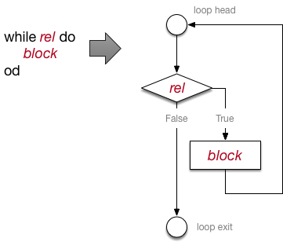
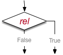

# Building a Compiler for the Duck Machine

It will be hard to sell a large number of Duck Machine computers
if we can only program it in assembly language.  We need a 
higher level language for it.  But building a Python compiler
or interpreter for it would be a lot of work ... maybe too
much even for awesome CIS 211 students to accomplish in a week. 

Also, since our Duck Machine can only 
input and print integers, it might be better to create a simple 
language that only handles integers.  

## Introducing Mallard, a language for Duck Machines

Mallard is a very simple language in which we can write programs
like this: 

```mallard
#
# Calculate the factorial of an integer.
#
x = read;
fact = 1;
while x > 1 do
    fact = fact * x;
    x = x - 1;
od;
print fact;
```

Mallard has variables like x and fact, assignments,
and simple arithmetic expressions with addition, subtraction, 
multiplication, and division.  
It has loops and if statements with arithmetic comparisons like 
`==` and `>`.  Mallard does not have functions or classes. 

### Control flow: while and if

The 'while' loop in Mallard is 'while *comparison* do *block* od', 
where *comparison* is an arithmetic comparison like `==`, `<=', 
`>`, etc.
 and *block* is a sequence of statements. 

An 'if' statement in Mallard may have an 'else', but there is
no 'elif', and the end of an 'if' is marked with 'fi': 

```mallard
# In this program, the first input is a value to "watch for"
# in a sequence.  In the rest of the sequence, we count
# occurrences of that value.  The sequence ends with 0.
# We print the count of occurrences of that value.
#
watch = read;
count = 0;
observe = read;
while  observe != 0 do
    if watch == observe then
       count = count + 1;
    fi;
    observe = read;
od;
print count;
```

### Input and output

In Mallard, `read` is a special expression that reads an 
integer value from the keyboard and returns that value. 

`print` is not an expression but a kind of statement.  
`print *expr*`
causes the value of expression *expr* to be printed. 

3D graphics and virtual reality are not yet supported in Mallard. 

## The Mallard Interpreter

I have developed an *interpreter* for Mallard programs, 
which I will provide to you.  Unfortunately the interpreter does 
not yet run on Duck Machines, because it is written in Python, 
but we may be able to reuse parts of it to build a compiler 
that produces assembly code for a Duck Machine.  

The Mallard interpreter builds an *abstract syntax tree* to 
represent a Mallard program, and then evaluates that tree. 
In other words, it is almost like our calculator program 
except that it reads a whole file instead of a single 
line, and it has a few more kinds of nodes (e.g., for 
*if* statements and for input and output).  In fact I started 
with our calculator project and just added a few things. 

I can run the interpreter like this: 

```bash
$ python3 compiler/interpreter.py programs/mal/fact.mal
```

The interpreter will parse my Mallard program (the first 
example above) and interact with me as follows: 

```
Quack! Gimme an int! 5
Quack! 120
#Interpretation complete
```

You may wish to write a few Mallard programs of your own 
to test your understanding of the language, and so that you 
can list Mallard programming skills on your resumé. 

# From Interpreter to Compiler

We'd like to run our Mallard programs on Duck Machines, but 
not by writing a Python interpreter to run our Mallard interpreter. 
Instead, we want to create a translator that reads a Mallard 
program and writes an equivalent Duck Machine assembly language program. 
Such translators are called *compilers* for historical 
reasons.   Technically our translator is a *cross-compiler*, since we 
run the translator on one kind of computer to produce machine code 
for a different kind of computer (the Duck machine).   

This should be easy!  Our Mallard programs are limited to 
integers, and our Duck Machine can compute with integers. 
And we've already got an assembler for the Duck Machine, 
so our compiler can produce assembly language and we can 
use our assembler to turn it into Duck Machine object code. 

Maybe not *super* easy ... but we don't need to rewrite the 
parser.  The existing parser creates tree structures 
using the Expr classes in `expr.py`.  The interpreter 
calls the `eval` methods on nodes in the tree.  A 
compiler can work similarly, except instead of calling `eval`, 
it can call a method that creates assembly code.  For example, 
a the `gen` method of a `Var` node for variable 
*x* might produce 

```
    LOAD  r5,x
```

and the `gen` method of a `Plus` node might generate

```
    ADD   r5,r4,r5
```

We just need to add the `gen` methods to classes 
in `expr.py`.  How hard can that be? 

## Tactics for Code Generation 

The Duck Machine is a register-oriented machine. 
It can load from 
memory and store to memory, but all the calculations take values 
from registers and store values in registers.  Thus, a major part 
of the job of generating code will be managing registers.  

Aside from register management, the `gen` method will be a 
lot like the `eval` method.  For example, if we have an expression
node like `Plus`, we'll generate code for the left-hand operand
of the addition, then we'll generate code for the right-hand 
operand, and then we'll generate code for adding the two 
results.   

What about variables?  Suppose we have a program like 

```
x = 7; 
y = x + 3; 
```

We want the assembly code for this to look something like 

```
   LOAD r1,const_7
   STORE r1,var_x
   LOAD r1,var_x
   LOAD r2,const_3
   ADD  r1,r1,r2
   STORE r1,var_y
   HALT  r0,r0,r0
const_7:  DATA  7
const_3:  DATA  3
var_x:    DATA 0
var_y:    DATA 0
```

Note that we don't want to intersperse the memory holding 
variables (and even constants!) with instructions.  We need 
to put them together at the end of the program.  We won't be 
able to print all the assembly code on-the-fly as we execute 
the `gen` methods.  We'll need a way of storing up different 
sets of information and then printing everyhing in the right 
order when we are done.  

Perhaps our biggest challenge is just breaking the programming 
task down into a nice incremental development plan, so we can 
code a little, test a little, code some more, test some more. 
How can we break off a little bit to get started? 

## The Littlest Duckling

To build small parts of our compiler, we'll try to build 
a compiler for a small part of our language.  We do want to have 
an overall plan for building the whole thing, but then we'll 
start by building a compiler that only works for very restricted 
programs --- e.g., the first Mallard program we try to compile might be 

```
x = 7; 
```

For that we'll need `gen` methods for ```IntConst```
and `Assign`, and maybe nothing else.  We'll gradually build
up more of the language by adding `gen` methods for more 
classes. 

## Code Generation Context

We noted above that the `gen` methods cannot just print 
assembly code on the fly, because it needs to come out in an 
order different than the order in which we call the `gen` methods. 

In particular, we need to save up the variables and constants 
and place the corresponding `DATA` lines at the end of the 
program.  We also need to keep track of the registers in use.  
We'll create a special kind of *context* object for both kinds
of record keeping.   In general, the header of a `gen` 
method will look like: 

```python
    def gen(self, context: Context, target: str): 
        """Generate code into the context object. 
        Result of expression evaluation will be 
        left in target register.
        """
```

Let's add the `gen` method to the abstract base class
`Expr` in the usual way.  We can make it give a clear
message about which class we forgot to add a `gen` method
to, like this: 

```python
        raise NotImplementedError(f"gen method not defined for class {self.__class__.__name__}")
```
        

The `gen` method will not return a value, but will 
add information to the context object, after passing that 
context object to the `gen` methods of its operands. 
While `gen` itself does not return a value, the code 
it generates will typically produce a value in a register. 
The `target` argument will tell it which register the
generated code should leave a value in.  The context object
will also provide methods for allocating and deallocating 
additional registers as needed. 

_Aside_:  Writing code that writes code can be confusing.
It is not easy to remember that the `gen` method does
not return a result, but the code that the `gen` method
generates does return a result (in a Duck Machine register). 
When I get tangled up, I go back to simple examples, often
working backward from the result I want, to the code that 
will produce that result, to the code that will write 
that code that produces the result I want. I write it down
on paper, because that is the only way I can keep it straight. 

We'll begin a `codegen_context.py` file in the usual 
way, with a header comment and logging configuration.   

```python
"""
A container for the context information kept 
for assembly code generation while walking 
an abstract syntax tree. 

The context object is passed around from node to 
node during code generation. Having a context 
object, rather than a set of different pieces
of information passed around, isolates in one 
place several small design decisions:  How 
registers are allocated, how constants and variables
are declared, when and how the code is actually
emitted to the output file. 
"""

import logging
logging.basicConfig()
log = logging.getLogger(__name__)
log.setLevel(logging.INFO)
```

We'll define a single class, a ```Context```. 

```python
class Context(object):
    """The state of code generation"""
```

What goes in the context?  We've noted that it needs to 
keep track of variables and constants that will go at 
the end of the assembly language program.  Those can 
appear in any order as long as they are collectively at the 
end, but we want just one of them for each variable and for 
each constant, so they can be represented by dicts. 
We'll add these to the constructor of Context: 

```python
        # A table of integer constants to be declared at
        # the end of the source program.  The table maps
        # values to names, so that we can reuse them.
        self.consts: dict[str, int] = {}
    
        # A table of variables to be declared at
        # the end of the source program, with the
        # symbols used for them in the assembly code.
        self.vars: dict[str, str] = {}
```

But aside from those declarations, other lines of assembly 
code must appear in a definite order.  We'll keep them in a 
list and add them to the list in the proper order: 

```python
        # Instructions in the source code, as a list of
        # strings.
        self.assm_lines: list[str] = [ ]
```

What about registers?  Registers r0 and r15 are special, so 
registers r1 through r14 are those we can use in calculations. 
We will need to allocate and deallocate them during code 
generation.  There are several ways we could do that, but 
for the moment a list of the names of available registers seems like a 
reasonable choice. 

```python
        # The available registers
        self.registers = [ f"r{i}" for i in range(1,15)]
```

We'll add some methods to this Context class soon, but it will 
be easier to think about what they should look like if we start 
building some `gen` methods that use them. 

We'll also need to import this `Context` class into 
`expr.py`: 

```python
import context
from compiler.codegen_context import Context
```


## IntConst.gen

Recall that our first Mallard program is to be `x = 7;`. 
That will be represented as 

```python
Assign(Var(x), IntConst(7))
```

So, to generate code for this program, we need to create 
`gen` methods for `IntConst`, `Var`, and `Assign`. 

We'll start with `IntConst`.  We said the header of the 
`gen` method in `IntConst` should be 

```python
    def gen(self, context: Context, target: str): 
        """Generate code into the context object. 
        Result of expression evaluation will be 
        left in target register.
        """
```

So we need to do two things:  Create a DATA line for the 
constant, and create a LOAD instruction to move that 
constant value into the target register. 

We'll need a method in the `Context` class to help 
us create the DATA line. We won't create the DATA line immediately, but 
will make a note of the information we will need when it's 
time to create the DATA line at the end of the program.  Meanwhile, 
we need to determine what label that DATA line will have, so 
that we can use it in the LOAD instruction.  

```python
    def get_const_symbol(self, value: int) -> str:
        """Returns the name of the label associated
        with a constant value, and remembers to
        declare it at the end of the source code.
        """
        assert isinstance(value, int)
        if value < 0:
            label = f"const_n_{abs(value)}"
        else:
            label = f"const_{value}"
        self.consts[value] = label
        return label
```

What if the constant 42 appears several times in a program?
We'll generate the same label every time, so we'll have just
one copy of it in `self.consts`.  

This is a start, but we're not done with `IntConst`.  
When we use a register constant, we will need to load it's 
value into a register.  We want *IntConst.gen* to produce
some code that looks like 

```
    LOAD  r1,const_42
    # other code goes here 
const_42:  DATA  42
```

We'll need a method in the `Context` object for creating the 
*LOAD* instruction, and we'll need another method for retrieving 
all the code, including the *DATA* lines at the end.  

We've already created an instance variable `assm_lines`
in the `Context` object to hold the line of assembly 
code.  Now we can create a method for adding a line
to `assm_lines`: 

```python
    def add_line(self, line: str):
        """Add a line of assembly code"""
        self.assm_lines.append(line)
        log.debug("Added line, now {self.assm_lines}")
```

And we'll need a way to retrieve both the code added by 
`add_line` and the *DATA* lines corresponding to 
the constants we created with `get_const_symbol`.   
Retrieving data should not change the state of the `Context`
object, so the `get_lines` method will begin by making a copy
of `assm_lines` before appending the *DATA* lines. 
While the order in which DATA declarations appear is 
unimportant, it will be easier to write test cases if they 
appear in a predictable order, so we will sort them. 

```python
    def get_lines(self) -> list[str]:
        """Get all the generated source code, including
        declarations of variables and constants.
        """
        code = self.assm_lines.copy()
        for constval in sorted(self.consts):
            code.append(f"{self.consts[constval]}:  DATA {constval}")
        return code

```

We haven't yet added declarations for variables, but we'll add those shortly. 

With all this, we are finally ready to generate code for the `IntConst`
class.  The `gen` method of `IntConst` should obtain the label of 
the *DATA* line where the constant value will be stored in Duck Machine memory 
and generate a *LOAD* instruction to move it into the target register: 

```python
    def gen(self, context: Context, target: str):
        """Generate code into the context object.
        Result of expression evaluation will be
        left in target register.
        """
        label = context.get_const_symbol(self.value)
        context.add_line(f"    LOAD {target},{label}")
        return
```

That was a fair amount of work just to get a constant value into a 
register, but it's a good start on what we'll need for other 
expression nodes.  It's time to build some simple test cases
before we go on. 

## Testing Code Generation 

Creating test cases was already challenging for our assembler, because 
we didn't care about some details like spaces.  We have the same 
problem with code generation, where in addition to the number of 
spaces we don't care about several other things, like the names 
of labels and the order in which constants appear in the generated 
code.  We can make use of the `squish` function again, but it is 
just too much work to create a function to canonicalize *all* of the 
things we don't care about.  We'll resort to writing very simple unit
test cases that are dependent on minor details.  When the code 
generator is more complete, we'll test it by generating code for 
Mallard programs and then assembling them with our assembler and 
executing them with our Duck Machine simulator.  

The outline of our test suite module should look pretty familiar by now.  
In this one I'll factor out a bit more of the code that we use to 
compare lists of strings.   

For convenience, we'll make `crush` also 
work with a multi-line (triple-quoted) string, which 
we will then break into a list of lines. The `Union` type
from the `typing` module lets us say that input argument to 
`crush` can be either `str` or `list[str]`. 

_Warning: Watch out for PyCharm
bugs that turn `\n` into `\\n` or vice versa in 
markdown documents.  And if you
see FOUR backslashes, you know the bug has
bitten you).

```python
"""Test Codegen:
Simple unit tests for parts of our code generator.
More complete tests will require us to go through the
whole cycle of compiling a Mallard program, assembling the
generated assembly code, and executing the resulting
object code on our Duck Machine simulator.  The test
cases here just catch some bugs in the pieces as we
build up the full code generator.
"""

import unittest
from expr import *
from codegen_context import Context
from typing import List, Union


def squish(s: str) -> str:
    """Discard initial and final spaces and compress
    all other runs of whitespace to a single space,
    """
    parts = s.strip().split()
    return " ".join(parts)

def crush(text: Union[str, List[str]]) -> List[str]:
    """Whether given a single multi-line string or a
    list of strings (each being one line of text),
    'crush' returns a list of squished lines.
    """
    # If it's a single multi-line string, break
    # it into lines
    if isinstance(text, str):
        lines = text.split("\n")
    else:
        # If it's not a string, it better be a list of strings
        assert isinstance(text, list)
        lines = text
    squished = [squish(l) for l in lines]
    crushed = [l for l in squished if len(l) > 0]
    return crushed

class AsmTestCase(unittest.TestCase):

    def codeEqual(self, generated: List[str], expected: str) -> bool:
        gen = crush(generated)
        exp = crush(expected)
        self.assertEqual(len(gen), len(exp))
        for i in range(len(gen)):
            self.assertEqual(gen[i], exp[i])


# test cases will go here. 

if __name__ == "__main__":
    unittest.main()
```

Then my test case for the code generator of `IntConst` be a little simpler
by inheriting from `AsmTestCase`:


```python
class Test_IntConst_Gen(AsmTestCase):
    """Generating code for an IntConst"""

    def test_42(self):
        const = IntConst(42)
        context = Context()
        const.gen(context, "r12")
        expected = """
             LOAD  r12,const_42
        const_42:  DATA 42
        """
        generated = context.get_lines()
        self.codeEqual(generated, expected)

    def test_42n(self):
        const = IntConst(-42)
        context = Context()
        const.gen(context, "r12")
        expected = """
             LOAD  r12,const_n_42
        const_n_42:  DATA -42
        """
        generated = context.get_lines()
        self.codeEqual(generated, expected)
```

That was quite a bit of work just to write and test the code generation 
for integer constants.  Fortunately a lot of it just needed to be done 
once.  We aren't completely done with the `Context`
class yet, but we're getting close. 

## Var.gen 

What about the variable *x*?  This is a little bit tricky.  
If *x* appeared in an expression on the right hand side 
of the assignment, we would want to generate code to get 
the *value* of *x*.  But on the left hand side of an 
assignment statement, we don't want the value of *x*.  We 
just want the name of the location in which to store a new 
value.  (Bonus trivia:  In compiler construction, this is actually called 
an *lvalue*.)  So instead of creating the `gen` method for class 
`Var` now, we'll create an `lvalue` method in `Var`. 
The `lvalue` method will need a method in the `Context` 
object to get the label, very similar to the method we used to 
get a label for a constant: 

```python
    def get_var_symbol(self, name: str) -> str:
        """Returns the name of the label associated
        with a constant value, and remembers to
        declare it at the end of the source code.
        """
        label = f"var_{name}"
        self.vars[name] = label
        return label
```

We are counting on variable names being unique in a Mallard program. 
If Mallard had functions or classes with local scopes, we would need
a more sophisticated way to handle the association of variables with 
labels.  

Now the `lvalue` method of a `Var` object can just return the 
label associated with that variable: 

```python
    def lvalue(self, context: Context) -> str:
        """Return the label that the compiler will use for this variable"""
        return context.get_var_symbol(self.name)
```

For all other variable references, we will need a `gen` method 
much like the `gen` method for `IntConst`. 
The only difference here is that we are calling `get_var_symbol`
(which we have already written!) instead of `get_const_symbol`, 
and we are using the variable name instead of the constant value. 

```python
    def gen(self, context: Context, target: str):
        """Generate code into the context object.
        Result of expression evaluation will be
        left in target register.
        """
        label = context.get_var_symbol(self.name)
        context.add_line(f"    LOAD {target},{label}")
        return
```

We will also need to add the variable declarations to `Context.getlines`. 
It doesn't really matter whether they come before or after the constants, 
but to make testing easier I'll stipulate that DATA lines for variables 
come after DATA lines for constants.  I'll leave that to you.  

We can test it in the same way: 

```python
class Test_Var_Gen(AsmTestCase):
    "Generating code for Variable reference (rvalue)"

    def test_var(self):
        var = Var("silly")
        context = Context()
        var.gen(context, "r8")
        expected = """
              LOAD  r8,var_silly
         var_silly:  DATA 0
         """
        generated = context.get_lines()
        self.codeEqual(generated, expected)
```

## Assign.gen

We are almost to the point of generating the tiniest real program, 
`x = 7;`.  We need code for an assignment.  An assignment generates 
code for the expression on its right hand side (7, in this case), and 
stores the value in the variable on its left hand side.  Easy peasy! 

```python
    def gen(self, context: Context, target: str):
        """Store value of expression into variable"""
        loc = self.left.lvalue(context)
        self.right.gen(context, target)
        context.add_line(f"   STORE  {target},{loc}")
``` 

And a test: 

```python
class Test_Assign_Gen(AsmTestCase):
    "Generating code for Variable reference (rvalue)"

    def test_assign(self):
        context = Context()
        assignment = Assign( Var("universe"), IntConst(42))
        assignment.gen(context, "r5")
        expected = """
              LOAD  r5,const_42
              STORE r5,var_universe
         const_42: DATA 42
         var_universe: DATA 0
         """
        generated = context.get_lines()
        self.codeEqual(generated, expected)
```

It's almost a program!  But not quite.  We need to add a ```HALT``` instruction
at the end, and it's time we had a main program. 

## compile.py

I have provided the compiler driver program for you.  It is very similar to the 
interpreter.  It places a few lines of comment at the beginning of the output 
file: 

```python
    context = codegen_context.Context()
    context.add_line("# Lovingly crafted by the robots of CIS 211")
    context.add_line(f"# {datetime.datetime.now()} from {sourcefile.name}")
    context.add_line("#")

```

and at the end of the program it adds the ```HALT``` instruction before 
extracting the generated code from the ```Context``` object: 

```python
        context.add_line("\tHALT  r0,r0,r0")
        assm = context.get_lines()
        log.debug("assm = {}".format(assm))
        for line in assm:
            print(line, file=args.outfile)
        print("#Compilation complete")
```

There is just one more thing we need, though:  We need a way to 
 determine which registers to use.  We've already created the list of 
names of available registers in the `Context` object.  We need to create 
two additional `Context` methods to manage them.  They 
are very simple ... their code is shorter than their 
docstrings. 

```python
    def allocate_register(self) -> str:
        """Get the name of a register that is not otherwise 
        occupied. Keep exclusive access until it is returned with 
        free_register(reg).
        """
        return self.registers.pop()
    
    def free_register(self, reg_name: str):
        """Return the named register to the pool of 
        available registers. 
        """
        self.registers.append(reg_name)
```

Now `compile` can allocate a register to pass to the ```gen``` method of
the expression.  Aside from a try/catch block to deal with possible 
errors, the main logic of `compile` simply reads and parses 
the input to create an `Expr` object, allocates a single register, and passes that register 
name to the `gen` method of the `Expr` object. 

```python
        exp = parse(args.sourcefile)
        work_register = context.allocate_register()
        exp.gen(context, work_register)
        context.free_register(work_register)
        context.add_line("\tHALT  r0,r0,r0")
        assm = context.get_lines()
        log.debug("assm = {}".format(assm))
        for line in assm:
            print(line, file=args.outfile)
        print("#Compilation complete")
```

We can run the compiler on our tiny example program in a 
terminal window: 

```commandline
$ python3 compiler/compile.py programs/mal/littlest.mal 
```

Then we should see the assembly code it produces:

```commandline
# Lovingly crafted by the robots of CIS 211
# 2022-05-08 19:05:48.954870 from programs/mal/littlest.mal
#
    LOAD r14,const_7
   STORE  r14,var_x
        HALT  r0,r0,r0
const_7:  DATA 7
var_x:  DATA 0
INFO:__main__:#Compilation complete
```

That last line that starts with INFO is a log message
that we can ignore. 
If we sent the assembly language into a file, it would 
still appear at the console: 

```commandline
$ python3 compiler/compile.py programs/mal/littlest.mal programs/asm/littlest.asm
INFO:__main__:#Compilation complete
```

## Seq.gen

Emboldened by success, we may move on to a program that 
contains *two* assignment statements, or even *three*. 
A sequential block of code is represented by a `Seq`
node.  We can see that its `eval` method simply 
executes its left operand and then its right operand. 
Code generation can work similarly:  Generate code for the 
left operand, and then for the right operand.  

I will leave `Seq.gen` to you.  When you have it, 
you should be able to compile this tiny Mallard program 

``` 
# A tiny program to test code
# generation for the Seq expression class.
#
x = 7;
y = x;
z = y;
```

using a terminal window (within or outside of PyCharm)
like this: 

```commandline
$ python3 compiler/compile.py programs/mal/seq.mal 
# Lovingly crafted by the robots of CIS 211
# 2022-05-08 19:17:27.032666 from programs/mal/seq.mal
#
    LOAD r14,const_7
   STORE  r14,var_x
    LOAD r14,var_x
   STORE  r14,var_y
    LOAD r14,var_y
   STORE  r14,var_z
        HALT  r0,r0,r0
const_7:  DATA 7
var_x:  DATA 0
var_y:  DATA 0
var_z:  DATA 0
INFO:__main__:#Compilation complete
```

## Binop.gen

For binary operations `Plus`, `Minus`, 
`Div`, and `Mul`, we can factor out much of the 
logic of `gen` into `Binop`, much as we did before 
for the `eval` method.  The only difference between 
them is that each has its own operation code in 
the assembly language.  In each of the concrete 
classes we can implement a method that returns that 
operation code.   In `Binop` we'll create an abstract
version of the `opcode` method: 

```python
    def opcode(self) -> str:
        """Which operation code do we use in the generated assembly code?"""
        raise NotImplementedError("Each binary operator should define the opcode method")
```

For example, in the ```Plus``` class 
we will implement it as 

```python
    def _opcode(self) -> str:
        return "ADD"
```

Then we can implement `gen` in `Binop` and inherit 
it in `Plus`, `Minus`, etc: 

```python
    def gen(self, context: Context, target: str):
        self.left.gen(context, target)
        reg = context.allocate_register()
        self.right.gen(context, reg)
        context.add_line(f"   {self._opcode()}  {target},{target},{reg}")
        context.free_register(reg)
```

I leave the rest of the binary operations to you. We can 
perform some very simple test cases to make sure we 
didn't forget any of the basic operations. 

```python
class Test_Binops_Gen(AsmTestCase):
    """A simple shakedown of each binary operation"""

    def test_plus_gen(self):
        context = Context()
        target = context.allocate_register()
        e = Plus(Var("x"), IntConst(3))
        e.gen(context, target)
        expected = """
        LOAD r14,var_x
        LOAD r13,const_3
        ADD  r14,r14,r13
        const_3: DATA 3
        var_x:   DATA 0
        """
        generated = context.get_lines()
        self.codeEqual(generated, expected)

    def test_minus_gen(self):
        context = Context()
        target = context.allocate_register()
        e = Minus(Var("x"), IntConst(3))
        e.gen(context, target)
        expected = """
        LOAD r14,var_x
        LOAD r13,const_3
        SUB  r14,r14,r13
        const_3: DATA 3
        var_x:   DATA 0
        """
        generated = context.get_lines()
        self.codeEqual(generated, expected)

    def test_times_gen(self):
        context = Context()
        target = context.allocate_register()
        e = Times(Var("x"), IntConst(3))
        e.gen(context, target)
        expected = """
        LOAD r14,var_x
        LOAD r13,const_3
        MUL  r14,r14,r13
        const_3: DATA 3
        var_x:   DATA 0
        """
        generated = context.get_lines()
        self.codeEqual(generated, expected)


    def test_div_gen(self):
        context = Context()
        target = context.allocate_register()
        e = Div(Var("x"), IntConst(3))
        e.gen(context, target)
        expected = """
        LOAD r14,var_x
        LOAD r13,const_3
        DIV  r14,r14,r13
        const_3: DATA 3
        var_x:   DATA 0
        """
        generated = context.get_lines()
        self.codeEqual(generated, expected)

    def test_binop_combo(self):
        """Combining the operations involves some register
        management.
        """
        e = Plus(Times(Var("x"), Var("y")), Minus(IntConst(2), IntConst(3)))
        context = Context()
        target = context.allocate_register()
        e.gen(context, target)
        expected = """
        LOAD r14,var_x
        LOAD r13,var_y
        MUL r14,r14,r13
        LOAD r13,const_2
        LOAD r12,const_3
        SUB r13,r13,r12
        ADD r14,r14,r13
        const_2: DATA 2
        const_3: DATA 3
        var_x: DATA 0
        var_y: DATA 0
        """
        generated = context.get_lines()
        self.codeEqual(generated, expected)
```


If those work, we can write and compile programs with simple or 
complex arithmetic expressions

```
# Test code generation for a sequence
# of binary operations
#
x = 7;
y = x + 7;
z = x * y;
q = x - y / z;
```

again at the terminal like this: 

```commandline
$ python3 compiler/compile.py programs/mal/binops.mal 
# Lovingly crafted by the robots of CIS 211
# 2022-05-08 19:23:11.015294 from programs/mal/binops.mal
#
    LOAD r14,const_7
   STORE  r14,var_x
    LOAD r14,var_x
    LOAD r13,const_7
   ADD  r14,r14,r13
   STORE  r14,var_y
    LOAD r14,var_x
    LOAD r13,var_y
   MUL  r14,r14,r13
   STORE  r14,var_z
    LOAD r14,var_x
    LOAD r13,var_y
    LOAD r12,var_z
   DIV  r13,r13,r12
   SUB  r14,r14,r13
   STORE  r14,var_q
        HALT  r0,r0,r0
const_7:  DATA 7
var_x:  DATA 0
var_y:  DATA 0
var_z:  DATA 0
var_q:  DATA 0
INFO:__main__:#Compilation complete
```

## Print.gen

As we can generate more complex programs, it will 
get harder and harder to tell whether the code generation 
is correct just by looking at it.  We can write tiny test 
cases for code generation for individual classes, but we'd 
like to gain some confidence that our code generation for 
more complex expressions and programs is correct. 

A nice way to gain that confidence is by assembling and 
executing our generated code, and see if it actually 
prints what we expect it to print.   Right now our 
programs can't print anything, because we haven't 
created a code generation method for the `Print` 
class yet.  Let's fix that next. 

In the current model of the Duck Machine, memory address 
511 is mapped to output.  Code for `Print` should 
store a value to that address: 

```python
    def gen(self, context: Context, target: str):
        """We print by storing to the memory-mapped address 511"""
        self.expr.gen(context, target)
        context.add_line(f"   STORE  {target},r0,r0[511]")
```

We can test it with a simple program

``` 
#  Simple test to print a computed value
x = 7;
y = 8;
print x + y;  # Should print 15
```

Again from the terminal command line:

```commandline
$ python3 compile.py mallard/print.mal 
# Lovingly crafted by the robots of CIS 211, Spring 2019
# 2019-05-29 09:10:09.925726 from mallard/print.mal
#
    LOAD r14,const_7
   STORE  r14,var_x
    LOAD r14,const_8
   STORE  r14,var_y
    LOAD r14,var_x
    LOAD r13,var_y
   ADD  r14,r14,r13
   STORE  r14,r0,r0[511]
        HALT  r0,r0,r0
const_7:  DATA 7
const_8:  DATA 8
var_x:   DATA 0
var_y:   DATA 0
#Compilation complete
```

But is it correct?  To find out, we'll save the assembly code 
to a file, then assemble it, then run it on a Duck 
Machine.  We can do each of those steps manually, but it is 
tedious.  Recall the way we created an `asmgo` program
that combined two phases of assembly language translation plus
execution.  The `malgo` program similarly combines all three
of those steps with the compiler. 

```commandline
$ python3 run/malgo.py programs/mal/print.mal 
INFO:compiler.compile:#Compilation complete
Quack!: 15
Halted
```

## Read.gen

We might as well complement the output with input.  It will be 
very similar, except that it will read a value into the 
target register by executing a `LOAD` instruction from 
memory address 510.  I'll leave that to you.  Then we will 
be able to compile this program: 

```
# Sum of two inputs
x = read;
y = read;
print x + y;
```

We will compile and run the program as before: 

```commandline
$ python3 run/malgo.py programs/mal/read_add_print.mal 
INFO:compiler.compile:#Compilation complete
Quack! Gimme an int! 5
Quack! Gimme an int! 3
Quack!: 8
Halted
```

It is quite difficult to write a simple, automated unit
test for *read* and *print*!  (It's not impossible, but the test
cases would be far more complicated than the code we are
testing.)

## Negation and absolute value

We have *almost* taken care of all the arithmetic operations, but we have 
the unary operations ```Neg``` and ```Abs``` to go.  Negation is simple: 
We just subtract from zero.   I'll leave that to you. 

```Abs``` is a little tougher.   There is no single Duck Machine instruction that 
we can use to implement it.  We will need to generate a test and a branch.  
Suppose the value is in register r5.  Then we would need code that looks 
roughly like this: 

```
     SUB  r0,r5,r0           # Just to get the condition code
     JUMP/P  it_is_positive  
     SUB  r5,r0,r5           # Flip the sign 
it_is_positive:   # Whew
```

We can't use the same label "it_is_positive" every time we generate code for absolute 
value, so we need yet one more thing from our `Context` object:  A source of fresh labels. 
We'll initialize a counter in the constructor of the `Context` class, and provide a 
new method that appends a count to some prefix passed to the method.  For example, we
might call `context.new_label("it_is_positive")` and get as a result 
"it_is_positive_28".  

```python
    def new_label(self, prefix: str) -> str:
        """Return a unique label starting with prefix"""
        self.label_count += 1
        return f"{prefix}_{self.label_count}"
```

Now it is easy to write ```Abs.gen```: 

```python
    def gen(self, context: Context, target: str):
        self.left.gen(context, target)
        pos = context.new_label("already_positive")
        context.add_line(f"    SUB  r0,{target},r0  # <Abs>")
        context.add_line(f"    JUMP/PZ {pos}")
        context.add_line(f"    SUB {target},r0,{target}  # Flip the sign")
        context.add_line(f"{pos}:   # </Abs>")
```

Again we can create some very simple automated unit tests, 
but for confidence that we not only got what we expected but 
also something that works, we'll want to compile and run a
simple program.  First, the unit test cases: 

```python
class Test_Unops_Gen(AsmTestCase):
    """Unary operations Neg and Abs"""

    def test_neg_gen(self):
        context = Context()
        target = context.allocate_register()
        e = Neg(IntConst(8))
        e.gen(context, target)
        expected = """
        LOAD r14,const_8
        SUB  r14,r0,r14 # Flip the sign 
        const_8: DATA 8
        """
        generated = context.get_lines()
        self.codeEqual(generated, expected)


    def test_abs_gen(self):
        context = Context()
        target = context.allocate_register()
        e = Abs(IntConst(-3))
        e.gen(context, target)
        expected = """
        LOAD r14,const_n_3
        SUB  r0,r14,r0  # <Abs>
        JUMP/PZ already_positive_1
        SUB r14,r0,r14  # Flip the sign
        stay_positive_1:   # </Abs>
        const_n_3:  DATA -3
        """
        generated = context.get_lines()
        self.codeEqual(generated, expected)
```

Then, a tiny program ```absdiff.mal``` that should print 
the absolute and then negative absolute value of the 
difference between two inputs.  Compile, assemble, and run it 
to be sure! 

```
# Absolute difference
# (test case for Abs and Neg)
# Prints the absolute difference between x and y,
# and -1 * that value.
#
x = read;
y = read;
absdiff = @(x - y);
neg = ~absdiff;
print absdiff;
print neg;
```

## Control flow: While.gen

Our programs are very simple sequences of instructions 
so far.  Mallard has two branching control flow 
constructs, *while* loops and *if* statements.  
These should generate JUMP instructions to 
control execution of the program.  For example, 
a *while* loop should generate a conditional jump 
to the loop exit, and an unconditional jump to the 
loop head, to implement the looping control flow: 



We will implement this in two parts.  The comparison operation 
classes will take care of conditional branching, and the `While`
class will be in charge of the overall pattern for the loop.  
(This way we will be able to re-use the conditional branching 
logic for *if* statements.) 

The comparison classes like `EQ` (for `==`) and `GE` (for `>=`)
will not implement a `gen` method to place a value in a register. 
Instead, they will implement a 
 `condjump` method that creates a conditional JUMP.  For each of them 
we will have two options, a JUMP if the relation is true 
(e.g., for `EQ` the relation is true if the compared values 
are equal), and a JUMP if the relation is false.  

```python
    def condjump(self, context: Context, target: str, label: str, jump_cond: bool = True):
        """Generate jump to label conditional on relation. """
```



We compare by 
performing a subtraction.   As usual we would like to factor as 
 much of the common behavior as possible into an abstract base 
 class for comparisons, leaving just a little for each
 particular comparison.  Here is my abstract base 
class for comparisons:

```python
class Comparison(Control):
    """A relational operation that may yield 'true' or 'false',
    In the interpreter, relational operators ==, >=, etc
    return an integer 0 for False or 1 for True, and the "if" and "while"
    constructs use that value.
    In the compiler, "if" and "while" delegate that branching
    to the relational construct, i.e., x < y does not create
    a value in a register but rather causes a jump if y - x
    is positive.  Condition code is the condition code for
    the conditional JUMP after a subtraction, e.g., Z for
    equality, P for >, PZ for >=.
    For each comparison, we give two condition codes: One if
    we want to branch when the condition is true, and another
    if we want to branch when the condition is false.
    (Currently the compiler only uses the cond_code_false
    conditions, because it is jumping to the 'else' branch
    or out of the loop.)
    """
    def __init__(self, left: Expr, right: Expr,
                 opsym: str, cond_code_true: str, cond_code_false: str):
        self.left = left
        self.right = right
        self.opsym = opsym
        self.cond_code_true = cond_code_true
        self.cond_code_false = cond_code_false

    def __str__(self) -> str:
        return f"{str(self.left)} {self.opsym} {str(self.right)}"

    def __repr__(self) -> str:
        return f"{self.__class__.__name__}({repr(self.left)}, {repr(self.right)})"

    def __eq__(self, other: "Expr") -> bool:
        return type(self) == type(other) and  \
            self.left == other.left and \
            self.right == other.right

    def eval(self) -> "IntConst":
        """In the interpreter, relations return 0 or 1.
        Each concrete subclass must define _apply(int, int)->int
        """
        left_val = self.left.eval()
        right_val = self.right.eval()
        return IntConst(self._apply(left_val.value, right_val.value))

    def gen(self, context: Context, target: str):
        """We don't support using relational operators to
        produce a value (although it would be easy to add).
        """
        raise NotImplementedError("Relational operators do not support 'gen'; try 'condjump'")

    def condjump(self, context: Context, target: str, label: str, jump_cond: bool = True):
        """Generate jump to label conditional on relation. """
        self.left.gen(context, target)
        reg = context.allocate_register()
        self.right.gen(context, reg)
        if jump_cond:
            cond = self.cond_code_true
        else:
            cond = self.cond_code_false
        # All relations are implemented by subtraction.  What varies is
        # the condition code controlling the jump.
        context.add_line(f"   SUB  r0,{target},{reg}")
        context.add_line(f"   JUMP/{cond}  {label}  #{self.opsym}")
        context.free_register(reg)
```

With this, I need very little to implement the `EQ` comparison class.  It needs an `_apply` method for the interpreter, 
but for the compiler code generator we can just provide the operator symbol, the condition code for a conditional 
branch if the relation is true, and a condition code for a conditional branch if the condition is false.  

```python
class EQ(Comparison):
    """left == right"""

    def __init__(self, left: Expr, right: Expr):
        super().__init__(left, right, "==", "Z", "PM")

    def _apply(self, left: int, right: int) -> int:
        return 1 if left == right else 0
```

You may not be familiar with the ternary expression used in _apply.  *expr* if *cond* else *expr*  is just Python shorthand 
for a very simple if/then/else block, compacting it down to a single line. 

You will need to fill in code generation for the other comparisons:  NE (not equal), LT (less than), LE (less than 
or equal, which I prefer to pronounce as "at most"), GT (greater than), and GE (greater than or equal, which 
I prefer to pronounce as "at least").  Although `JUMP/PZ'
is exactly the same as `JUMP/ZP`, let's make testing easier
by always giving combinations of flags in the order `P`, `Z`, `M`. 


Here are some test cases 
to check them: 

```python
class Test_Condjump(AsmTestCase):

    def test_EQ_iftrue(self):
        """==, jump if true"""
        context = Context()
        target = context.allocate_register()
        e = EQ(IntConst(3), IntConst(5))
        e.condjump(context, target, "here_if_true")
        expected = """
        LOAD  r14,const_3
        LOAD  r13,const_5
        SUB   r0,r14,r13
        JUMP/Z  here_if_true #==
        const_3: DATA 3
        const_5: DATA 5
        """
        generated = context.get_lines()
        self.codeEqual(generated, expected)

    def test_EQ_iffalse(self):
        """==, jump if false"""
        context = Context()
        target = context.allocate_register()
        e = EQ(IntConst(3), IntConst(5))
        e.condjump(context, target, "here_if_false", jump_cond=False)
        expected = """
        LOAD  r14,const_3
        LOAD  r13,const_5
        SUB   r0,r14,r13
        JUMP/PM  here_if_false #==
        const_3: DATA 3
        const_5: DATA 5
        """
        generated = context.get_lines()
        self.codeEqual(generated, expected)

    def test_NE_iftrue(self):
        """!=, jump if true"""
        context = Context()
        target = context.allocate_register()
        e = NE(IntConst(3), IntConst(5))
        e.condjump(context, target, "here_if_true")
        expected = """
        LOAD  r14,const_3
        LOAD  r13,const_5
        SUB   r0,r14,r13
        JUMP/PM  here_if_true #!=
        const_3: DATA 3
        const_5: DATA 5
        """
        generated = context.get_lines()
        self.codeEqual(generated, expected)

    def test_NE_iffalse(self):
        """!=, jump if false"""
        context = Context()
        target = context.allocate_register()
        e = NE(IntConst(3), IntConst(5))
        e.condjump(context, target, "here_if_false", jump_cond=False)
        expected = """
        LOAD  r14,const_3
        LOAD  r13,const_5
        SUB   r0,r14,r13
        JUMP/Z  here_if_false #!=
        const_3: DATA 3
        const_5: DATA 5
        """
        generated = context.get_lines()
        self.codeEqual(generated, expected)

    def test_GT_iftrue(self):
        """>, jump if true"""
        context = Context()
        target = context.allocate_register()
        e = GT(IntConst(3), IntConst(5))
        e.condjump(context, target, "here_if_true")
        expected = """
        LOAD  r14,const_3
        LOAD  r13,const_5
        SUB   r0,r14,r13
        JUMP/P  here_if_true #>
        const_3: DATA 3
        const_5: DATA 5
        """
        generated = context.get_lines()
        self.codeEqual(generated, expected)

    def test_GT_iffalse(self):
        """>, jump if false"""
        context = Context()
        target = context.allocate_register()
        e = GT(IntConst(3), IntConst(5))
        e.condjump(context, target, "here_if_false", jump_cond=False)
        expected = """
        LOAD  r14,const_3
        LOAD  r13,const_5
        SUB   r0,r14,r13
        JUMP/ZM  here_if_false #>
        const_3: DATA 3
        const_5: DATA 5
        """
        generated = context.get_lines()
        self.codeEqual(generated, expected)

    def test_GE_iftrue(self):
        """>=, jump if true"""
        context = Context()
        target = context.allocate_register()
        e = GE(IntConst(3), IntConst(5))
        e.condjump(context, target, "here_if_true")
        expected = """
        LOAD  r14,const_3
        LOAD  r13,const_5
        SUB   r0,r14,r13
        JUMP/PZ  here_if_true #>=
        const_3: DATA 3
        const_5: DATA 5
        """
        generated = context.get_lines()
        self.codeEqual(generated, expected)

    def test_GE_iffalse(self):
        """>=, jump if false"""
        context = Context()
        target = context.allocate_register()
        e = GE(IntConst(3), IntConst(5))
        e.condjump(context, target, "here_if_false", jump_cond=False)
        expected = """
        LOAD  r14,const_3
        LOAD  r13,const_5
        SUB   r0,r14,r13
        JUMP/M  here_if_false #>=
        const_3: DATA 3
        const_5: DATA 5
        """
        generated = context.get_lines()
        self.codeEqual(generated, expected)

    def test_LT_iftrue(self):
        """<, jump if true"""
        context = Context()
        target = context.allocate_register()
        e = LT(IntConst(3), IntConst(5))
        e.condjump(context, target, "here_if_true")
        expected = """
        LOAD  r14,const_3
        LOAD  r13,const_5
        SUB   r0,r14,r13
        JUMP/M  here_if_true #<
        const_3: DATA 3
        const_5: DATA 5
        """
        generated = context.get_lines()
        self.codeEqual(generated, expected)

    def test_LT_iffalse(self):
        """>=, jump if false"""
        context = Context()
        target = context.allocate_register()
        e = LT(IntConst(3), IntConst(5))
        e.condjump(context, target, "here_if_false", jump_cond=False)
        expected = """
        LOAD  r14,const_3
        LOAD  r13,const_5
        SUB   r0,r14,r13
        JUMP/PZ  here_if_false #<
        const_3: DATA 3
        const_5: DATA 5
        """
        generated = context.get_lines()
        self.codeEqual(generated, expected)

    def test_LE_iftrue(self):
        """<=, jump if true"""
        context = Context()
        target = context.allocate_register()
        e = LE(IntConst(3), IntConst(5))
        e.condjump(context, target, "here_if_true")
        expected = """
        LOAD  r14,const_3
        LOAD  r13,const_5
        SUB   r0,r14,r13
        JUMP/ZM  here_if_true #<=
        const_3: DATA 3
        const_5: DATA 5
        """
        generated = context.get_lines()
        self.codeEqual(generated, expected)

    def test_LE_iffalse(self):
        """>=, jump if false"""
        context = Context()
        target = context.allocate_register()
        e = LE(IntConst(3), IntConst(5))
        e.condjump(context, target, "here_if_false", jump_cond=False)
        expected = """
        LOAD  r14,const_3
        LOAD  r13,const_5
        SUB   r0,r14,r13
        JUMP/P  here_if_false #<=
        const_3: DATA 3
        const_5: DATA 5
        """
        generated = context.get_lines()
        self.codeEqual(generated, expected)
```

With comparisons implemented, it is relatively easy 
to implement while loops.  
At the head of a while loop, we should check the 
condition and, if the condition is not true, exit the 
loop.  This will be a 
conditional jump to a label just after the loop. 
At the bottom of the loop, we just jump unconditionally 
back to the head of the loop.  We have already seen 
how to obtain unique labels.  The code generation 
for ```While``` can therefore be 

```python
    def gen(self, context: Context, target: str):
        """Looping"""
        loop_head = context.new_label("while_do")
        loop_exit = context.new_label("od")
        context.add_line(f"{loop_head}:")
        self.cond.condjump(context, target, loop_exit, jump_cond=False)
        self.expr.gen(context, target)
        context.add_line(f"   JUMP  {loop_head}")
        context.add_line(f"{loop_exit}:")
```

Here's a simple unit test: 

```python
class Test_While_Gen(AsmTestCase):

    def test_while_gen(self):
        context = Context()
        target = context.allocate_register()
        e = While(EQ(Var("x"), Var("x")), Assign(Var("x"), Minus(Var("x"), IntConst(1))))
        e.gen(context, target)
        expected = """
        while_do_1: 
        LOAD  r14,var_x
        LOAD  r13,var_x
        SUB  r0,r14,r13
        JUMP/PM  od_2    #==
        LOAD  r14,var_x
        LOAD  r13,const_1
        SUB   r14,r14,r13
        STORE r14,var_x
        JUMP  while_do_1
        od_2: 
        const_1: DATA 1
        var_x: DATA 0
        """
        generated = context.get_lines()
        self.codeEqual(generated, expected)
```

Now we are really beyond the level where we can look at 
the test case and be convinced that the expected output
is correct.  Again we can improve our confidence by also 
executing a small Mallard program.  
 `countdown.mal` should 
print the integers from 10 to 1: 

```
# Simple test of while loop ---
# counts down from 10 to 1

x = 10;

while x do
   print x;
   x = x - 1;
od;
```

If we run it in the interpreter, we get 

```commandline
Quack!: 10
Quack!: 9
Quack!: 8
Quack!: 7
Quack!: 6
Quack!: 5
Quack!: 4
Quack!: 3
Quack!: 2
Quack!: 1
Quack!: 0
#Interpretation complete
```

If we use our compiler to translate it to assembly code, then 
use our assembler (both passes) to create object code, then 
use our Duck Machine simulator to execute it, we should get 
almost the same output: 

```commandline
$ python3 run/malgo.py programs/mal/countdown.mal 
INFO:compiler.compile:#Compilation complete
Quack!: 10
Quack!: 9
Quack!: 8
Quack!: 7
Quack!: 6
Quack!: 5
Quack!: 4
Quack!: 3
Quack!: 2
Quack!: 1
Quack!: 0
Halted
```

## Pass.gen

Mallard does not have a 'pass' statement, but nonetheless 
there is a `Pass` class in `expr.py`.   That is 
because we can write an *if* statement with or without 
an *else* part.  In the `If` class, there is always 
an *else* part, but sometimes it is a `Pass`
object.  

Code generation for `Pass` is simple, as you might 
expect: 

```python
    def gen(self, context: Context, target: str):
        pass
```

I am not going to bother writing a unit test case for `Pass`, 
but instead we will write test cases for *if* statements 
with and without *else* clauses. 

## If.gen 
 
Now 
you should be ready to figure out code generation for *if/else/fi*.  
You will need a label for the code in the *else* part and a label 
for the end of the *if/else/fi*.  The basic outline is 

* Test the condition of the *if* statement.  If it is false, 
jump to the *else* part. 

* Generate code for the *then* part. 

* Jump to the end of the *if/else/fi*. 

* Generate the label for the *else* part, followed by 
 the code for the *else* part.  
 
 * Generate the label for the end of the *if/else/fi*
 
 All the basic parts (checks, labels, and jumps) are present
 in the ```While``` code generation.  
 
 This unit test assumes you use "else" as the prefix for the 
 label of an *else* part and "fi" as the prefix for the label 
 at the end of an *if/else/fi* construct, i.e., you call 
 `context.new_label("else")` and `context.new_label("fi")`. 
 
```python
class Test_If_Gen(AsmTestCase):

    def test_if_gen(self):
        context = Context()
        target = context.allocate_register()
        e = If(EQ(Var("x"), IntConst(1)),
               Assign(Var("y"), Minus(Var("x"), IntConst(1))),
               Assign(Var("x"), IntConst(2)))
        e.gen(context, target)
        expected = """
        LOAD  r14,var_x
        LOAD  r13,const_1
        SUB  r0,r14,r13
        JUMP/PM  else_1 #==
        LOAD  r14,var_x
        LOAD  r13,const_1
        SUB   r14,r14,r13
        STORE r14,var_y
        JUMP  fi_2
        else_1: 
        LOAD r14,const_2
        STORE r14,var_x 
        fi_2: 
        const_1: DATA 1
        const_2: DATA 2
        var_x: DATA 0
        var_y: DATA 0
        """
        generated = context.get_lines()
        self.codeEqual(generated, expected)
```

And of course we need a Mallard program to convince 
ourselves that the generated code does what it is 
supposed to do.  How about a loop that counts down 
from 100 and prints the integers that are divisible 
by 5?  Here is ```fives.mal```:

``` 
# Count down from 100, printing
# integers that are divisible by 5.

x = 100;

while x > 0 do

  # If y divides x evenly,
  # then y * (x / y) = x
  remainder = x - 5 * (x / 5);
  if remainder == 0 then
     print x;
  fi;
  x = x - 1;

od;
```

When I translate this (through all the stages of compilation and assembly)
to Duck Machine object code, and then run the object code in my Duck 
Machine simulator, I get: 

```commandline
$ python3 run/malgo.py programs/mal/fives.mal 
INFO:compiler.compile:#Compilation complete
Quack!: 100
Quack!: 95
Quack!: 90
Quack!: 85
Quack!: 80
Quack!: 75
Quack!: 70
Quack!: 65
Quack!: 60
Quack!: 55
Quack!: 50
Quack!: 45
Quack!: 40
Quack!: 35
Quack!: 30
Quack!: 25
Quack!: 20
Quack!: 15
Quack!: 10
Quack!: 5
Halted
```

# Summing up 

Mallard is a simple language, and our compiler is taking 
some short cuts, like assuming it will never run short of 
registers.  Nonetheless a code generator for a compiler is 
a pretty substantial project for an introductory CS course. 
We can tackle it because we take it piece by piece and 
keep it as simple as we can.  
